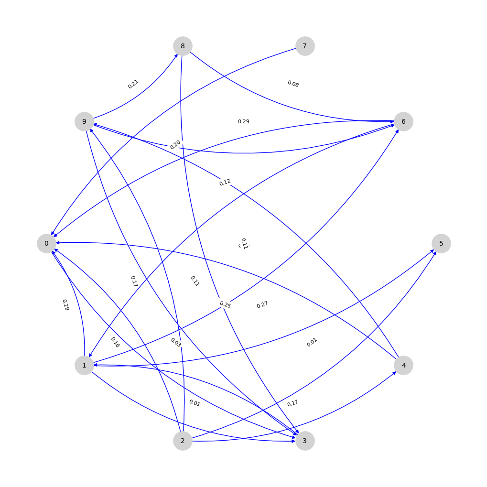

# 🥃 COGNAC: COoperative Graph-based Networked Agent Challenges

[](https://pepy.tech/project/cognac)


[](https://www.apache.org/licenses/LICENSE-2.0.txt)
[](https://cognac-marl.readthedocs.io/en/latest/)


## 📚 [Documentation](https://cognac-marl.readthedocs.io/en/latest/) is available here : https://cognac-marl.readthedocs.io/en/latest/ .

COGNAC is a Python-based benchmark suite offering **flexible**, **graph-structured**, **cooperative multi-agent** environments for MARL research. The package offers standardized minimal implementations of several well-known theoretical **graph-based MARL problems** taken from the literature, adapted for empirical benchmarking with modern RL tooling.

🎯 Benchmark example available [here](https://github.com/yojul/cognac-benchmark-example)

## Getting Started

### Standard Installation
You can install cognac from pip very easily if you want to use the environment and all standard features _out-of-the-box_.
```bash
pip install cognac

```

### Advanced installation
If you plan to explicitely modify the environments, not only changing hyperparameters but also changing the dynamics. We recommend the following :
```bash
git clone https://github.com/yojul/cognac.git
cd cognac
pip install -e .
```

### Quickstart

```python
from cognac.env import BinaryConsensusNetworkEnvironment
from cognac.utils.graph_utils import generate_adjacency_matrix, plot_influence_graph

# Utility for generating random adjacency matrix
adjacency_matrix = generate_adjacency_matrix(10)

# Ploting influence graph (see figure below)
plot_influence_graph(adjacency_matrix)

# Instantiating environment with adjacency matrix and default parameters
env = BinaryConsensusNetworkEnvironment(adjacency_matrix=adjacency_matrix)

# Standard PettingZoo usage. See PettingZoo documentation for more details.
obs, infos = env.reset()
obs, rewards, dones, truncs, infos = env.step(
    {agent: env.action_space(agent).sample() for agent in env.possible_agents}
)
```
_Here is an example of randomly generated adjacency matrix:_
<p align="center">

</p>

---

## List of Environments

| Environment            | Modular Size | Graph Agnostic | Joint State Space         | Joint Act. Space          | Env. description |
|------------------------|--------------|----------------|--------------------------|--------------------------|----------------|
| Firefighting Graph (1D)   | ✔️           | ❌             | $$\theta^N$$              | $$2^N$$                   | Multiple agents (firemen) cooperate to extinguish fires on a line of houses, with partial and noisy observations of fire levels, probabilistic fire spreading and extinguishing dynamics, and rewards based on reducing fire levels at their controlled locations.
| Firefighting Graph (2D)   | ✔️           | ❌             | $$\theta^{N \times M}$$   | $$4^N$$                   | 2-Dimensional adaptation of the 1D env with a grid of houses. Each agent control 4 houses.
| Binary Consensus         | ✔️           | ✔️             | $$2^N$$                   | $$2^N$$                   | Agents with binary votes iteratively choose to keep or switch their vote based on local neighborhood observations, aiming to reach consensus on the initial majority opinion within a time horizon on a graph-structured network.
| SysAdmin                 | ✔️           | ✔️             | $$9^N$$                   | $$2^N$$                   | Agents manage a network of computers that can be good, faulty, or dead, choosing at each step whether to reboot machines to restore functionality while balancing task progress, with the goal of maximizing completed tasks under fault propagation on a graph.
| Multi-commodity Flow     | ✔️           | ❌             | $$\rho_{max}^{k \times E}$$ | $$\rho_{max}^{k \times E}$$ | Each node-agent directs integer-valued flows of multiple commodities through outgoing edges on a capacitated network graph, aiming to minimize the total flow circulation cost while satisfying capacity and flow conservation constraints. 


---

## Citing

If you used this environment for your experiments or found it helpful, consider citing it:
<pre>
@inproceeding{sintes2025cognac,
  title={COGNAC: Cooperative Graph-based Networked Agent Challenges for Multi-Agent Reinforcement Learning},
  author={Sintes, Jules and Busic, Ana},
  url={\url{https://github.com/yojul/cognac}},
  journal={Advances in Neural Information Processing Systems},
  year={2025}
}
</pre>

---

## License

This project is licensed under the Apache-2.0 License. See [LICENSE.txt](LICENSE.txt) for details.

---

## Contact

For questions or feedback, please open an issue or contact the maintainer:

* **Repo Owner**: Jules Sintes, INRIA Paris, DIENS, École Normale Supérieure, PSL University.
* **Email**: [jules.sintes@inria.fr](mailto:jules.sintes@inria.fr)
