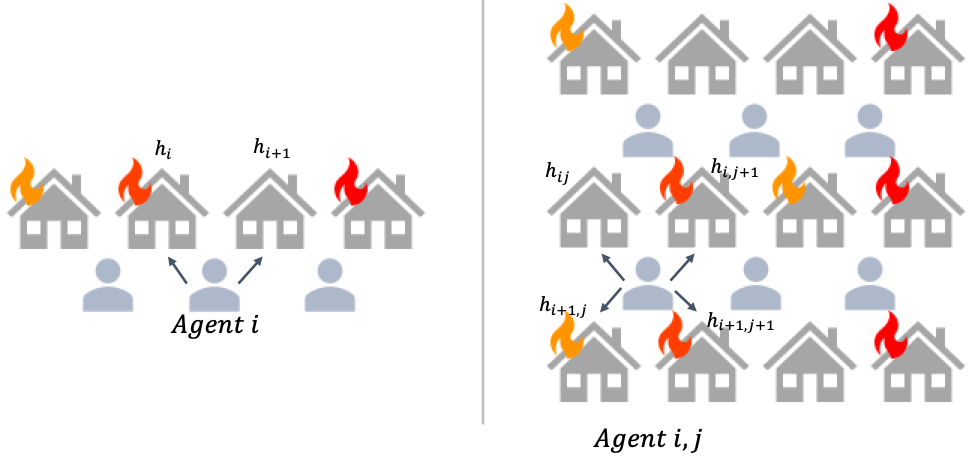

🔥 Firefighting Graph
====================================

The Fire Fighting Graph environment is a stylized Decentralized Partially Observable Markov Decision Process (Dec-POMDP) originally introduced by Oliehoek and Amato :cite:authorpar:`oliehoek2008exploiting`, :cite:authorpar:`oliehoek2016concise`. It serves as a classical benchmark for studying decision-making over Dynamic Bayesian Networks (DBNs) in cooperative multi-agent settings. This environment can model real-world domains such as epidemic control :cite:authorpar:`hu2024decentralized`, communication networks :cite:authorpar:`ooi1996decentralized`, :cite:authorpar:`mahajan2016decentralized`, and traffic systems :cite:authorpar:`soton351021`.

In the base version of the problem, a line of :math:`N+1` houses is protected by :math:`N` agents (firefighters), each responsible for extinguishing fires at two neighboring locations. The underlying structure can be represented as a bipartite graph, with agent nodes and house nodes.

This package implements two variants:

- The original 1D version with :math:`N` agents and :math:`N+1` houses.
- A novel 2D grid extension with :math:`N \times M` agents and :math:`(N+1) \times (M+1)` houses.

The following description focuses on the 1D version. The 2D extension is described in the supplementary material.

Environment Description
-----------------------

  
  Illustration for the Firefighting Graph problem (in 1D and 2D).

State and Observation
~~~~~~~~~~~~~~~~~~~~~

The system state at time :math:`t` is the fire level at each house:

.. math::

    S(t) = \{ s_h(t) \}_{h=1}^{N+1}, \quad \text{where} \quad s_h(t) \in [0, \theta)

Agents do not have access to the full system state. Each agent only receives a stochastic observation of the fire level at the house they are currently monitoring. The observation accuracy depends on the actual fire level, introducing uncertainty and partial observability into the problem.

By default (following :cite:authorpar:`oliehoek2016concise`):

- If a house is not burning (fire level 0), fire is observed with probability 0.2.
- If the fire level is low (1), fire is observed with probability 0.5.
- At higher fire levels, fire is observed with probability 0.8.

The environment also maintains internal information about agent locations, which influence observations and rewards.

Action Space
~~~~~~~~~~~~

Each agent may move to either of its two designated houses—house :math:`i` or :math:`i+1`—and attempt to extinguish the fire.

In the 1D setting:

- Two agents at the same house extinguish all fire with high probability (default = 1.0).
- A single agent can reduce the fire level by one unit:
  - With high probability if adjacent houses are not burning.
  - With reduced probability (default = 0.6) if fire is present in neighboring houses.

In the 2D version, agents can move to any of the four adjacent houses (up, down, left, right).

Reward and Objective
--------------------

Episodes end when all houses are extinguished (i.e., fire level is 0 everywhere), or after reaching a maximum time horizon :math:`T`.

Each agent receives a negative reward based on the fire level of the house it is currently assigned to. Formally:

.. math::

    r_i(t) = 
    \begin{cases}
        -s_i(t) & \text{if agent $i$ is at house $i$} \\
        -s_{i+1}(t) & \text{if agent $i$ is at house $i+1$}
    \end{cases}

The agents are fully cooperative and must learn to coordinate their actions and positions to extinguish fires as quickly and efficiently as possible.

Summary
-------

This environment provides a simple yet expressive testbed for decentralized cooperation under uncertainty. Its modular structure and 2D extension make it a versatile benchmark for multi-agent reinforcement learning research, especially in domains requiring coordination on dynamic spatial networks.

Environment
---------------------------------------

.. automodule:: cognac.env.FirefightingGraph.env
   :members:
   :show-inheritance:
   :undoc-members:
   :private-members:

Rewards
-------------------------------------------

.. automodule:: cognac.env.FirefightingGraph.rewards
   :members:
   :show-inheritance:
   :undoc-members:
   :private-members: