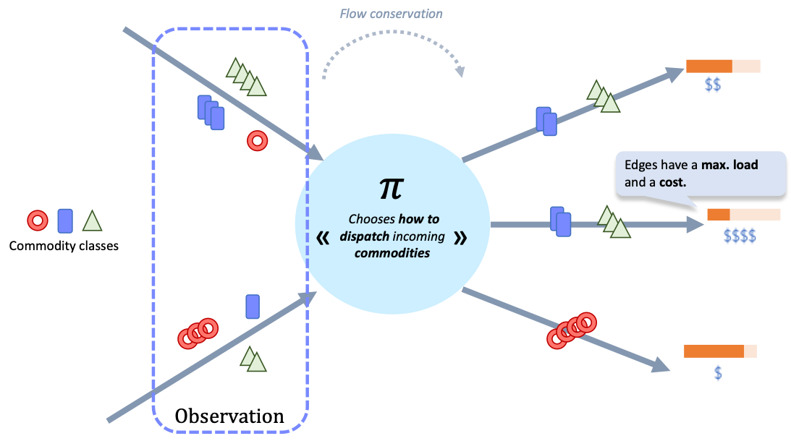

🔁 Multi-Commodity Flow Environment
===================================

This environment is based on the classical multi-commodity flow problem from combinatorial optimization :cite:`ahuja1993network`, formulated in a partially observable, decentralized multi-agent reinforcement learning setting.

In this environment, each agent controls a node in a directed graph and decides how to dispatch incoming flows to its outgoing edges. The network supports multiple commodities (i.e., types or classes of flow), and the objective is to **minimize the total cost of flow circulation** while satisfying physical constraints like edge capacities and flow conservation.

This problem is challenging due to:

- The combinatorial structure of routing multiple flows.
- The decentralized nature of control (one agent per node).
- Integer flow constraints.
- Partial observability (agents only observe their own local neighborhood).

  
  Illustration for the multi-commodity flow problem representing the problem from the perspective of a single agent. The objective is to minimize the cost of operating the network. Each agent chooses how to dispatch incoming commodities to its outgoing edges at each step.

Overview
--------

The environment supports two main settings:

- **Circulation problems**: All nodes are circulation nodes with initial flows, no explicit sources or sinks.
- **Source-sink flow problems**: Flows must start at designated source nodes and terminate at sink nodes.

Constraints
-----------

The environment enforces the following constraints at each timestep:

- **Edge Capacity**: The total flow on edge :math:`(i, j)` cannot exceed its capacity :math:`\rho_{ij}`.
- **Flow Conservation at Circulation Nodes**: For each circulation node, the total incoming flow must equal the total outgoing flow.
- **Source/Sink Consistency**: Each flow must fully exit its source node and fully enter its sink node over the episode.

Let :math:`\rho_{\text{max}} = \max_{(i,j)} \rho_{ij}` denote the maximum edge capacity in the network.

State Space
-----------

Let:

- :math:`k` be the number of commodities (flow classes),
- :math:`N` the number of controllable nodes (agents),
- :math:`E` the number of directed edges.

The **global state** at time :math:`t` consists of the flow values on each of the :math:`E` edges for all commodities.

Each agent observes only the flows arriving on its own **incoming edges**, which may include flows from any commodity. There is no access to global state or the actions of other agents.

Action Space
------------

Each agent :math:`i` controls the dispatch of incoming flows across its outgoing edges.

- The action of agent :math:`i` is a vector (or matrix) with :math:`k \times n^{\text{out}}_i` entries, where :math:`n^{\text{out}}_i` is the number of outgoing edges from node :math:`i`.
- The values represent **integer flows** assigned to each edge per commodity.
- Internally, the policy outputs a continuous distribution over possible flow allocations, which is discretized into integer flow values.

Reward and Objective
--------------------

The goal is to **minimize the total cost** of flow circulation over the episode horizon :math:`T`.

- Each commodity and each edge has an associated cost.
- The cost incurred at time :math:`t` is computed based on the flows sent through each edge and their respective costs.
- The total episode reward is the negative sum of these flow costs, i.e., a cost-minimization objective.

This environment is a benchmark for multi-agent coordination, flow control under partial observability, and cooperative optimization in graph-structured settings. It is particularly well-suited for studying distributed reinforcement learning algorithms on networked systems.

Environment
------------------------------

.. automodule:: cognac.env.MultiCommodityFlow.env
   :members:
   :show-inheritance:
   :undoc-members:
   :private-members:

Rewards
----------------------------------

.. automodule:: cognac.env.MultiCommodityFlow.rewards
   :members:
   :show-inheritance:
   :undoc-members:
   :private-members: